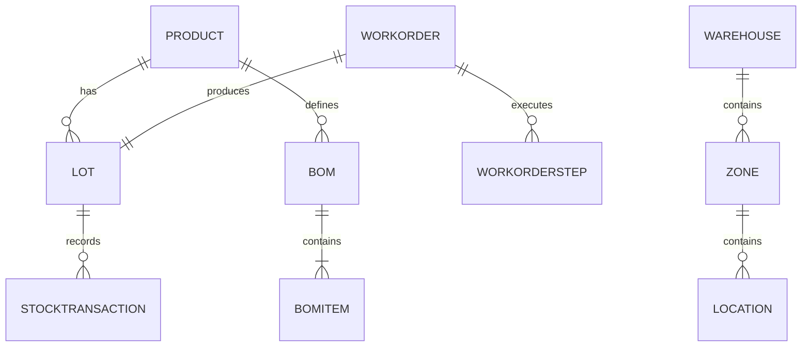

# 12_Entity_Relationship

# Entity Relationship

## Mục tiêu

Mô tả mối quan hệ giữa các Entity trong hệ thống WMS + MES, giúp AI hiểu cấu trúc dữ liệu và cách các module liên kết với nhau.

---

# 1. Nhóm Entity

## Master Data

- Product
- ProductCategory
- UnitOfMeasure
- Warehouse
- Zone
- Location
- Supplier
- Customer

## Warehouse

- StockBalance
- StockTransaction
- Lot
- MaterialReservation

## Manufacturing

- BOM
- BOMItem
- Routing
- RoutingStep
- WorkCenter
- WorkOrder
- WorkOrderStep

## Quality

- QCChecklist
- QCInspection

## Security

- User
- Role
- Permission
- AuditLog

---

# 2. Quan hệ chính

Product
1 ---- N Lot

Product
1 ---- N BOM

BOM
1 ---- N BOMItem

Product
1 ---- N StockBalance

Warehouse
1 ---- N Zone

Zone
1 ---- N Location

Location
1 ---- N StockBalance

WorkOrder
1 ---- N WorkOrderStep

WorkOrder
1 ---- 1 Lot

Routing
1 ---- N RoutingStep

Lot
1 ---- N StockTransaction

Lot
N ---- N Lot (qua LotGenealogy)

---

# 3. Aggregate Root

- Product
- Warehouse
- WorkOrder
- Lot
- QCInspection

---

# 4. Navigation Properties

Ví dụ:

Product
- Lots
- BOMs
- StockBalances

WorkOrder
- Steps
- OutputLot

Warehouse
- Zones

Zone
- Locations

---

# 5. Referential Integrity

- Không xóa Product nếu đã phát sinh giao dịch.
- Không xóa WorkOrder đã hoàn thành.
- Không xóa Lot đã sử dụng.
- Giữ toàn vẹn khóa ngoại.

---

# 6. Cascade Rules

- Warehouse -> Zone : Cascade
- Zone -> Location : Cascade
- Product -> StockTransaction : Restrict
- WorkOrder -> Lot : Restrict

---

# 7. Mermaid ERD (tham khảo)

---

# 8. AI Notes

- Entity Framework Core nên sử dụng Navigation Properties đầy đủ.
- Repository được tổ chức theo Aggregate Root.
- Khóa ngoại phải phản ánh đúng quan hệ nghiệp vụ.
- LotGenealogy là trung tâm của chức năng truy vết.
