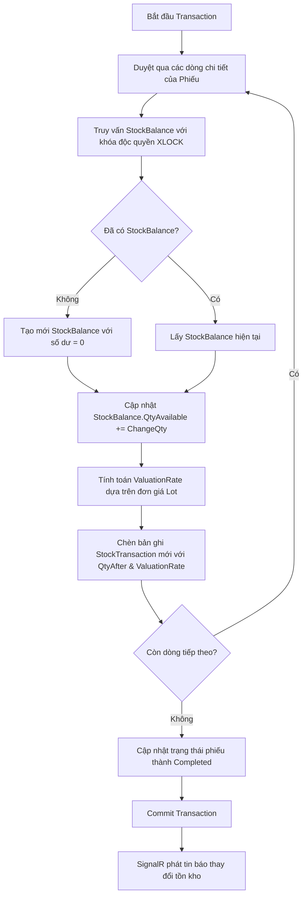

# Thiết kế Hệ thống Sổ cái Kho (Stock Ledger - Phase 1)

## 1. Tổng quan
Tài liệu này đặc tả thiết kế kỹ thuật cho **Phase 1: Sổ cái Kho & Quy trình Chứng từ (Stock Ledger Foundation)** thuộc lộ trình cải tiến hệ thống WMS + MES. 

Mục tiêu chính là chuyển đổi cơ chế quản lý kho từ cập nhật trực tiếp số dư sang quản lý dựa trên **Sổ cái Kho (Stock Ledger)**. Mỗi biến động kho sẽ tạo ra một bản ghi sổ cái cố định, giúp lưu lịch sử kiểm toán hoàn chỉnh, chống lệch số liệu và hỗ trợ cơ chế Hủy phiếu (Cancel) đảo ngược giao dịch.

---

## 2. Thay đổi Cơ sở dữ liệu (Database Schema)

### 2.1 Cập nhật thực thể `StockTransaction` (Sổ cái Kho)
Thực thể `StockTransaction` hiện tại sẽ đóng vai trò là Sổ cái Kho (Stock Ledger Entry - SLE). Chúng ta sẽ bổ sung các trường sau:

*   **File:** [StockTransaction.cs](file:///d:/Qu%E1%BA%A3n%20l%C3%BD%20s%E1%BA%A3n%20xu%E1%BA%A5t/Domain/Entities/StockTransaction.cs)
*   **Thuộc tính bổ sung:**
    ```csharp
    // Số dư khả dụng của (Product + Lot + Location) NGAY SAU khi dòng sổ cái này được ghi sổ
    [Column(TypeName = "decimal(18,2)")]
    public decimal QtyAfter { get; set; }

    // Giá vốn bình quan của sản phẩm tại thời điểm ghi sổ
    [Column(TypeName = "decimal(18,2)")]
    public decimal ValuationRate { get; set; }

    // Đánh dấu dòng sổ cái này là dòng đảo ngược của chứng từ bị hủy
    public bool IsCancelled { get; set; } = false;
    ```

### 2.2 Cập nhật Enum `DocumentStatus`
Bổ sung trạng thái `Cancelled` để hỗ trợ quy trình hủy phiếu.

*   **File:** [DocumentStatus.cs](file:///d:/Qu%E1%BA%A3n%20l%C3%BD%20s%E1%BA%A3n%20xu%E1%BA%A5t/Domain/Enums/DocumentStatus.cs)
*   **Mã nguồn cập nhật:**
    ```csharp
    namespace WmsMes.Web.Domain.Enums;

    public enum DocumentStatus
    {
        Draft = 0,
        Completed = 1,  // Đã xác nhận / Ghi sổ cái
        Cancelled = 2   // Đã hủy chứng từ
    }
    ```

---

## 3. Quy trình Ghi sổ cái & Cập nhật Số dư (Posting Engine)

Khi hoàn tất một chứng từ kho (ví dụ: `GoodsReceipt`, `GoodsIssue`, `StockTransfer`), hệ thống sẽ thực thi luồng sau trong một Database Transaction:



### 3.1 Tính toán Giá trị Tồn kho (Valuation Rate)
*   **Đối với Nhập kho (Receipt):** Nếu nhập vào Lot mới hoặc cập nhật Lot hiện tại, đơn giá bình quân của Lot sẽ được cập nhật đồng thời trong logic lưu trữ:
    $$\text{ValuationRate} = \text{Lot.UnitPrice}$$
*   **Đối với Xuất kho/Chuyển kho/Tự động xuất (Issue, Transfer, Backflush):**
    $$\text{ValuationRate} = \text{Đơn giá hiện tại của Lot được chọn}$$

---

## 4. Luồng Nghiệp vụ Hủy phiếu (Cancellation Workflow)

Chỉ cho phép hủy các phiếu ở trạng thái `Completed`. Quy trình hủy diễn ra như sau:

### 4.1 Hủy Phiếu Nhập kho (`GoodsReceipt`)
*   **Phương thức:** `CancelGoodsReceiptAsync(int receiptId, string userId)`
*   **Quy tắc nghiệp vụ:**
    1.  Tải thông tin phiếu nhập kho và toàn bộ các dòng chi tiết.
    2.  Với mỗi dòng chi tiết, tìm `StockBalance` tương ứng của (`ProductId`, `LotId`, `LocationId`).
    3.  **Kiểm tra tồn kho âm:** Kiểm tra xem `StockBalance.QtyAvailable - line.Qty` có nhỏ hơn 0 không. Nếu có, quăng lỗi: *"Không thể hủy phiếu nhập vì hàng hóa trong lô đã được xuất đi hoặc giữ chỗ."*
    4.  **Cập nhật tồn kho:** Trừ số dư khả dụng: `StockBalance.QtyAvailable -= line.Qty`.
    5.  **Ghi sổ cái đảo ngược:** Chèn bản ghi `StockTransaction` đối ứng:
        *   `Type = TransactionType.Receipt`
        *   `Qty = -line.Qty` (Giá trị âm)
        *   `QtyAfter = StockBalance.QtyAvailable`
        *   `IsCancelled = true`
        *   `ReferenceNo = receipt.ReceiptNo`
    6.  **Cập nhật Lot:** Trừ bớt `Qty` trên thực thể `Lot`. Nếu `Lot.Qty <= 0`, có thể khóa hoặc ẩn Lot.
    7.  Cập nhật trạng thái `receipt.Status = DocumentStatus.Cancelled`.
    8.  Lưu toàn bộ thay đổi trong Database Transaction.

### 4.2 Hủy Phiếu Xuất kho (`GoodsIssue`)
*   **Phương thức:** `CancelGoodsIssueAsync(int issueId, string userId)`
*   **Quy tắc nghiệp vụ:**
    1.  Tải thông tin phiếu xuất kho và toàn bộ các dòng chi tiết.
    2.  Với mỗi dòng chi tiết, tìm hoặc tạo `StockBalance` tương ứng của (`ProductId`, `LotId`, `LocationId`).
    3.  **Cập nhật tồn kho:** Cộng lại số dư khả dụng: `StockBalance.QtyAvailable += line.Qty`.
    4.  **Ghi sổ cái đảo ngược:** Chèn bản ghi `StockTransaction` đối ứng:
        *   `Type = TransactionType.Issue`
        *   `Qty = line.Qty` (Giá trị dương, đảo chiều của lượng xuất âm ban đầu)
        *   `QtyAfter = StockBalance.QtyAvailable`
        *   `IsCancelled = true`
        *   `ReferenceNo = issue.IssueNo`
    5.  Cập nhật trạng thái `issue.Status = DocumentStatus.Cancelled`.
    6.  Lưu toàn bộ thay đổi trong Database Transaction.

---

## 5. Thay đổi trên Giao diện Người dùng (UI/UX)

### 5.1 Trang chi tiết Phiếu Nhập kho & Xuất kho
*   **Files:** 
    *   `Views/Inventory/ReceiptDetails.cshtml`
    *   `Views/Inventory/IssueDetails.cshtml`
*   **Thay đổi:**
    *   Hiển thị Badge trạng thái:
        *   `Completed` -> Màu xanh lá ("Đã hoàn thành")
        *   `Cancelled` -> Màu đỏ ("Đã hủy")
        *   `Draft` -> Màu xám ("Nháp")
    *   Nếu trạng thái phiếu là `Completed`, hiển thị thêm nút **"Hủy phiếu" (Cancel)** ở góc trên bên phải.
    *   Khi bấm nút "Hủy phiếu", hiển thị Bootstrap Modal yêu cầu người dùng xác nhận: *"Bạn có chắc chắn muốn hủy phiếu kho này? Hành động này sẽ ghi nhận bút toán đảo ngược trên sổ cái và hoàn lại số dư kho."*
    *   Nút "Hủy phiếu" sẽ gọi API POST lên Controller để thực hiện nghiệp vụ.

### 5.2 Bổ sung cột trên trang Lịch sử Giao dịch Kho
*   **File:** `Views/Inventory/Transactions.cshtml`
*   **Thay đổi:**
    *   Hiển thị thêm cột **Số dư sau GD (`QtyAfter`)** và **Đơn giá vốn (`ValuationRate`)**.
    *   Các dòng có `IsCancelled == true` sẽ được hiển thị với màu chữ nhạt hoặc có nhãn đỏ **[Đã hủy]** bên cạnh mã chứng từ để dễ nhận diện.

---

## 6. Kế hoạch Kiểm thử & Xác minh (Verification Plan)

### 6.1 Automated Tests (xUnit)
Cần bổ sung các kiểm thử sau vào `WmsMes.Tests` để bảo đảm tính chính xác:

1.  **Test Ghi Sổ cái chính xác:**
    *   Thực hiện hoàn tất phiếu Nhập kho. Xác minh xem bản ghi `StockTransaction` sinh ra có chứa `QtyAfter` chính xác bằng tồn khả dụng trong `StockBalance` không.
2.  **Test Hủy phiếu Nhập kho thành công:**
    *   Tạo phiếu Nhập kho -> Hoàn tất -> Tiến hành Hủy.
    *   Xác minh `StockBalance.QtyAvailable` quay về đúng giá trị ban đầu.
    *   Xác minh có 2 dòng `StockTransaction` (1 dòng gốc dương, 1 dòng hủy âm).
3.  **Test Chặn Hủy phiếu Nhập khi thiếu hàng:**
    *   Nhập kho 100 sản phẩm -> Xuất đi 50 sản phẩm -> Thử Hủy phiếu Nhập ban đầu.
    *   Xác minh hệ thống quăng lỗi `InvalidOperationException` và không cho phép Hủy.
4.  **Test Hủy phiếu Xuất kho thành công:**
    *   Tạo phiếu Xuất kho -> Hoàn tất -> Tiến hành Hủy.
    *   Xác minh hàng được hoàn trả lại đúng vị trí kho đã xuất.

---

## 7. Các bước triển khai cho Codex (Implementation Steps)

- [ ] **Bước 1:** Cập nhật database schema (Thêm các cột mới vào `StockTransaction`, cập nhật enum `DocumentStatus` và tạo Migration).
- [ ] **Bước 2:** Cập nhật dịch vụ dịch thuật trong `CommonExtensions.cs` để hiển thị trạng thái `Cancelled` là "Đã hủy".
- [ ] **Bước 3:** Cập nhật `InventoryService.cs` phần `CompleteGoodsReceiptCoreAsync` và `CompleteGoodsIssueCoreAsync` để ghi các thông tin `QtyAfter` và `ValuationRate` vào `StockTransaction`.
- [ ] **Bước 4:** Xây dựng 2 hàm `CancelGoodsReceiptAsync` và `CancelGoodsIssueAsync` trong `InventoryService.cs`.
- [ ] **Bước 5:** Viết các Unit Tests tương ứng trong `WmsMes.Tests` để chạy kiểm tra.
- [ ] **Bước 6:** Cập nhật `InventoryController.cs` thêm các action POST xử lý Hủy phiếu và trả về kết quả JSON hoặc View.
- [ ] **Bước 7:** Nâng cấp UI của View Chi tiết phiếu kho để hiển thị nút Hủy và tích hợp Ajax gọi API hủy phiếu.
